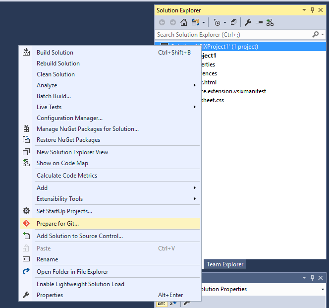

# Prepare For GitHub

<!-- Replace this badge with your own-->

<!-- Update the VS Gallery link after you upload the VSIX-->
Download this extension from the [VS Gallery](https://visualstudiogallery.msdn.microsoft.com/[GuidFromGallery])
or get the [CI build](http://vsixgallery.com/extension/7a42d726-bce1-4c17-8341-e455584ddb90/).

---------------------------------------

Prepare your projects to upload to GitHub

See the [change log](CHANGELOG.md) for changes and road map.

## Features

- Extracted from [Extensibility Tools](https://github.com/madskristensen/ExtensibilityTools)
- Supports Vsix Projects

### Usage
Right-click the solution node in Solution Explorer and click both of the buttons shown below.

## Contribute
Check out the [contribution guidelines](CONTRIBUTING.md)
if you want to contribute to this project.

For cloning and building this project yourself, make sure
to install the
[Extensibility Tools](https://visualstudiogallery.msdn.microsoft.com/ab39a092-1343-46e2-b0f1-6a3f91155aa6)
extension for Visual Studio which enables some features
used by this project.

## License
[Apache 2.0](LICENSE)